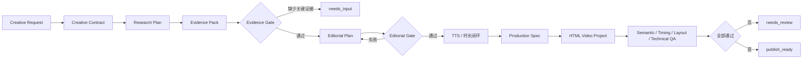

# Creative Pipeline V2 实施方案

## 1. 背景与根因

任务 `20260715091147355976` 暴露的不是单个 Prompt 或模板问题，而是创作流水线的职责边界错误：

1. 研究阶段用“来源数量、域名多样性”代替“用户要求是否有证据覆盖”，没有拿到 X 原帖仍可进入下一阶段。
2. 导演简报阶段既重写事实，又被固定场景数、资讯场景数量等结构规则驱动，模型会用无关材料填满结构。
3. Brief、Scene Spec、Content Graph、Frame HTML 多次解释同一语义，事实和主题可在下游漂移。
4. TTS 只作为后置素材，时间轴用目标时长反推，音频不足时把最后一帧静态延长。
5. `publish_ready` 只代表媒体技术检查通过，不代表事实、需求、时长和版式均通过。
6. 工作流 `done` 同时承载“后台执行结束”和“作品可发布”，状态语义混乱。

根治原则：**事实只在研究层确定一次，叙事只在编辑层确定一次，生产层只执行，不再改写事实。**

## 2. 目标与验收标准

### 2.1 目标

- 把用户输入转成可验证的 `Creative Contract`，明确必须覆盖项和禁止项。
- 把搜索结果转成按要求映射的 `Evidence Pack`，搜索列表不再直接充当证据。
- 用 `Editorial Plan` 一次性确定叙事，并通过确定性规则校验需求覆盖和事实引用。
- 用真实 TTS 时长生成 `Production Spec`，禁止用长时间静帧补齐目标时长。
- 用统一 QA 汇总事实、需求、时长、布局和技术检查，只有全部通过才可发布。
- 保留现有 JSON 工作流存储、任务事件、HTML Video 编辑器、渲染器和旧任务读取能力。

### 2.2 验收标准

| 指标 | 目标 |
| --- | --- |
| 关键要求覆盖率 | 100% |
| 无证据事实数 | 0 |
| 数字、时间、主体口径错误数 | 0 |
| Editorial Plan 之后的事实改写次数 | 0 |
| 末尾无声静帧 | 不超过 1 秒 |
| 阻塞级布局问题 | 0 |
| `publish_ready` 与完整 QA 结果一致率 | 100% |
| 关键证据不足时进入 `needs_input` | 100% |

## 3. 目标架构



### 3.1 稳定产物

所有产物继续存入现有工作流 JSON 的 `creative_context`，不引入数据库和新工作流框架。

#### `creative_contract`

```json
{
  "version": 2,
  "objective": "核验指定说法并给出结论",
  "audience": "关注 AI 产品动态的中文用户",
  "target": { "duration_sec": 30, "aspect_ratio": "9:16" },
  "must_cover": [
    { "id": "req_01", "text": "确认人物身份", "critical": true },
    { "id": "req_02", "text": "找到并核验原帖", "critical": true }
  ],
  "forbidden": ["伪造截图", "把相关性表述为因果性"],
  "visual_constraints": []
}
```

#### `evidence_pack`

```json
{
  "version": 2,
  "sources": [
    {
      "id": "src_01",
      "url": "https://example.com/original",
      "type": "primary",
      "title": "原始来源",
      "published_at": "2026-01-01T00:00:00Z",
      "retrieved_at": "2026-01-02T00:00:00Z"
    }
  ],
  "claims": [
    {
      "id": "claim_01",
      "requirement_ids": ["req_02"],
      "text": "可被脚本直接使用的原子事实",
      "status": "verified",
      "source_ids": ["src_01"]
    }
  ],
  "coverage": {
    "covered_requirement_ids": ["req_02"],
    "missing_critical_requirement_ids": ["req_01"],
    "ready": false
  }
}
```

#### `editorial_plan`

每个场景必须引用 `requirement_ids`、`claim_ids` 和 `source_ids`。旁白、字幕和画面文字只能使用被引用 Claim 中的事实，不允许下游自由补充资讯。

#### `production_spec`

由 Editorial Plan 和真实音频时长确定，包含场景实际时长、旁白、字幕、证据引用、布局原型和视觉文本。现有 `scene-spec.json` 作为兼容投影生成，不再是第二个语义模型输出。

#### `qa_report`

统一汇总：

- `contract_coverage`
- `factual_grounding`
- `narration_timing`
- `layout`
- `technical`

`publish_ready` 只能由该报告计算，禁止任一子系统自行写成 `true`。

## 4. 状态模型

兼容保留现有 `status`，新增两个明确维度：

- `execution_status`: `queued | running | waiting_input | failed | completed`
- `product_status`: `draft | research_incomplete | planned | voiced | editable | needs_review | publish_ready | exported`

兼容规则：

- `status=done` 仅表示 `execution_status=completed`。
- `product_status=publish_ready` 必须来自完整 QA。
- 旧任务没有 V2 字段时按旧逻辑只读展示，不伪装成 V2 已通过。

## 5. 实施步骤

### 阶段 1：契约、证据和确定性校验

- [x] 新增 V2 纯函数模块：Contract、Evidence Pack、Editorial Plan、QA。
- [x] 从现有创作上下文生成 Creative Contract。
- [x] 按 `must_cover` 逐项构建研究查询。
- [x] 将研究来源和研究结论规范化为 Evidence Pack。
- [x] 关键要求无证据时停止生产，状态进入 `waiting_input / research_incomplete`。
- [x] 增加任务 `20260715091147355976` 对应的回归测试。

### 阶段 2：Editorial Plan 取代 Freeform Brief 的开放式语义

- [x] 修改导演 Prompt，仅允许使用 Evidence Pack 中的 Claim。
- [x] 移除固定 3 场景、强制两条资讯、强制不同主体等 Goodhart 规则。
- [x] 校验所有关键要求均被场景覆盖、所有事实场景均有 Claim 引用。
- [x] 保留 Brief 字段作为旧生产接口兼容投影。

### 阶段 3：TTS 与 Production Spec 闭环

- [x] 以实际逐场景音频时长回写 Production Spec。
- [x] 目标固定且偏差超过 5% 时返回脚本修订，不允许直接补长最后一帧。
- [x] 时间轴尾部容差收紧到 1 秒。
- [x] Content Graph 改成 Production Spec 的确定性投影，停止再次改写语义。

### 阶段 4：完整 QA 与发布状态

- [x] 聚合 Contract、Evidence、Editorial、Timing、Layout、Technical QA。
- [x] 阻塞问题存在时进入 `needs_review`，不得标记 `publish_ready`。
- [x] 修正 HTML Video Lite 完成状态：可编辑不等于可发布。
- [x] API 和前端展示 `execution_status`、`product_status`、缺失证据和 QA 阻塞项。

### 阶段 5：兼容、清理和验证

- [x] 新任务写入 `pipeline_version: 2`，旧任务继续可读可编辑。
- [x] 失败重试从最近稳定产物恢复，并按依赖关系失效下游产物。
- [x] 删除被 V2 完全替代且无调用路径的旧规则和死代码。
- [x] 运行相关单测、完整测试和前端构建。

## 6. 文件边界

新增模块保持为无状态纯函数，避免把现有大文件继续膨胀：

```text
server/services/creative/pipeline/
  creativeContract.js
  evidencePack.js
  editorialPlan.js
  productionSpec.js
  qualityGate.js
```

现有编排仍由 `server/services/creative/creativeWorkflows.js` 负责；本次只把可独立验证的规则移出，不引入类、接口、工厂或额外依赖。

## 7. 失败与回退策略

1. **研究不足**：保留已取得证据，工作流进入等待输入，不生成貌似完整但偏题的成片。
2. **Editorial 校验失败**：仅重试 Editorial 阶段，不重新搜索或改写 Contract。
3. **TTS 超时长**：仅修订对应场景旁白并重新生成该场景音频。
4. **布局失败**：仅重生成对应 Frame HTML，不重跑研究和脚本。
5. **V2 内部异常**：明确失败并保留诊断，不静默回退到 V1。

## 8. 测试策略

- 纯函数单测覆盖 Contract 提取、Requirement/Claim 映射、关键证据门禁、Editorial 引用校验、时长门禁和发布状态计算。
- 工作流测试覆盖 `waiting_input`、`needs_review`、`publish_ready` 三条主路径。
- 回归夹具确保无关的 Nextdoor/Ona 来源不能满足 Codex 用户数核验要求。
- 现有 HTML Video 编辑器、重试、导出和 API 测试必须继续通过。

## 9. 明确不做

- 不新增数据库、消息队列、Temporal/LangGraph 或新的 Agent 框架。
- 不把搜索结果摘要直接当作可发布事实。
- 不用更多 Prompt 规则掩盖结构问题。
- 不在本次重写编辑器或渲染器。

## 10. 实施结果（2026-07-17）

- 已落地 `Creative Contract -> Evidence Pack -> Editorial Plan -> Production Spec -> QA Report` 主链路；用户直接提供的 HTTP(S) 来源会优先抓取，X 原帖同时从 Snowflake ID 恢复发布时间。
- Evidence Gate 改为按关键要求和事实锚点判定。搜索摘要、普通 URL 和无关来源不能生成 Claim；任务 `20260715091147355976` 的旧研究材料会稳定进入 `needs_input`。
- Editorial Gate 强制校验 Requirement、Claim、Source 三者映射，以及旁白中的数字和英文实体是否有 Claim 支持。
- V2 Content Graph 只做确定性投影；TTS 使用真实时长闭环，超出 5% 最多修订并重合成一次，尾部补帧上限为 1 秒。
- QA 统一控制作品状态；草稿工程为 `editable`，只有导出后且五类检查全部通过才进入 `publish_ready/exported`。
- V2 重试会校验产物哈希，从失败阶段继续，并先失效该阶段之后的脚本、音频、工程结果和 QA；V1 兼容规则因旧任务仍有真实调用路径而保留在条件分支中。
- 验证结果：Node.js 22 环境下 144 个测试文件全部通过；前端生产构建通过。真实渲染烟测按项目既有环境变量开关保持跳过。
